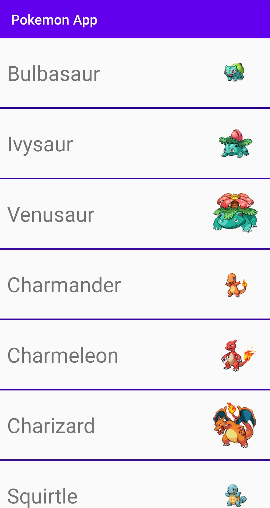
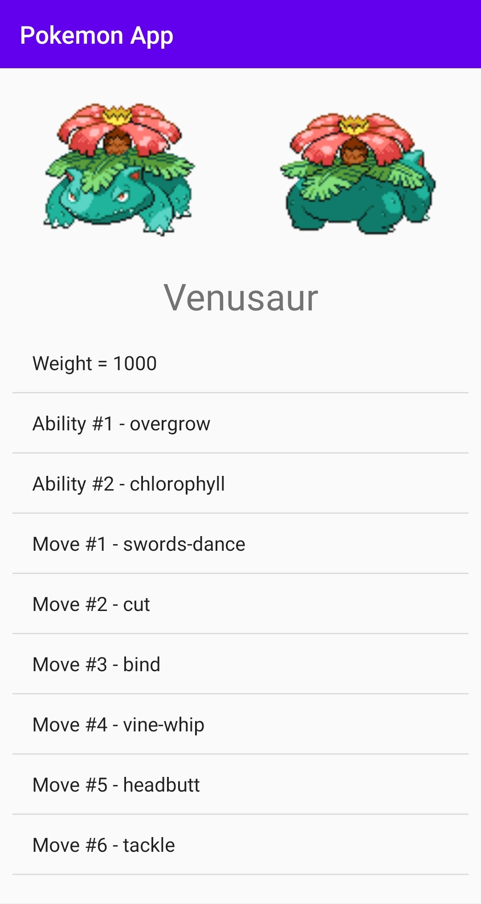

<h1 align="center">
  Pokemon App  
</h1>

Pokemon App is a project created by Bruno Ponte. This app uses the <a href="https://pokeapi.co/">PokéApi</a> to show a list of all pokemons, including its details and photos.

  

  

  
  

A aplicação possui apenas uma Activity, que é responsável por inicializar os dois Fragments existentes - no primeiro, PokemonListFragment, é possível ver a lista de Pokémons com respetivo nome e foto; no segundo, PokemonDetailsFragment, é possível ver os detalhes de um Pokémon, o que inclui nome, foto frontal e traseira, peso, habilidades, e "moves".

É utilizado o design pattern Model View ViewModel (MVVM), sendo que os Fragments representam as Views e cada um destes tem um ViewModel associado.

Foi utilizada a biblioteca Retrofit2, o que permitiu desenvolver a interface de pedidos ao PokéApi de forma rápida e clean. 

O GSON, do Retrofit2, também permitiu transformar as respostas dos pedidos em instâncias dos Models (desserialização) automaticamente através de anotações nas variáveis de instância dos mesmos, evitando a necessidade de fazer o parsing das respostas de todos os pedidos manualmente.

Foi criado um PokemonRepository, que é responsável por guardar a lista de Pokémons e utilizar a interface da API para obter os mesmos. 

Existe paginação da lista dos Pokémons (RecyclerView) no PokemonListFragment, isto foi alcançado através da interface da API que permite receber um offset e o tamanho da página para obter os Pokemons adequados. Estes campos são enviados para a PokéApi através dos Query Parameteres ("offset" e "limit").

Os Models existentes foram criados de forma a automatizar a sua desserialização por parte do Retrofit e GSON, sendo estes: SimplePokemonModel, PokemonModel, MoveModel, MoveWrapper, AbilityModel, AbilityWrapper, entre outros. 

A bibllioteca Picasso foi utilizada para facilitar o preenchimento das imagens dos pokemons nas respetivas ImageViews, através dos seus URLs.

Os próximo passo da implementação seria o desenvolvimento de testes unitários.

